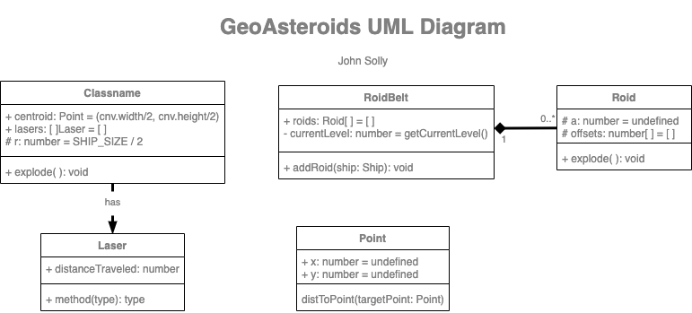

# GeoAsteroids

A 2D spaceship game, <a href="Geoasteroids.com">Geoasteroids.com</a>

[](https://travis-ci.org/badges/badgerbadgerbadger) [](https://coveralls.io/r/badges/badgerbadgerbadger) [](http://badges.mit-license.org)


---

## Table of Contents

- [Installation](#installation)
- [Features](#features)
- [Contributing](#contributing)
- [Team](#team)
- [FAQ](#faq)
- [Support](#support)
- [License](#license)

## Installation first if you don't have it already!)

1 - (Install <a href="https://nodejs.org/en/" rel="noopener noreferrer">Node.js</a>
2 - (Install <a href="https://www.mongodb.com/try/download/community" rel="noopener noreferrer">MongoDB</a>) (Or use a cloud service like <a href="https://www.mongodb.com/cloud/atlas" rel="noopener noreferrer">MongoDB Atlas</a>)

```shell
    $ git clone git@github.com:jsolly/GeoAsteroids.git
    $ cd GeoAsteroids
    $ npm install
```

## Run app

```shell
  # Start MongoDB locally (or use a cloud service like MongoDB Atlas)
  # Check src/database.ts for connection string
  $ cd <mongoDB_install_dir>/bin
  $ ./mongod --dbpath <path to data directory>
  $ vercel dev # Allows us to mock serverless functions locally
```

---

## Features

#### Functional

- Moving asteroids with variable jaggedness and size
- Points, lives and levels
- Spaceship with laser and thruster
- Global high score board

#### Non-Functional

- Asteroid collisions using circular bounding box
- Static code analysis using CodeQL
- NPM Dependency checking via Dependabot
- 100% linted with Eslint + additional rules.
- TypeScript under 'strict' mode with no errors or warnings.
- JS bundling with vite
- Serverless functions for API calls
- MongoDB database for high scores
- Custom logging library for fine grained control of logging levels
- Over 90% test coverage

## Coverage, Tests, Linting

#### Coverage

$ npm run coverage

#### Test

$ npm run test

#### Linting (with ESlint)

$ npm run lint

---

## Contributing

Want to work on this with me? DM me <a href="https://twitter.com/_jsolly" target="_blank">`@_jsolly`</a>

### Step 1

- **Option 1**

  - 🍴 Fork this repo!

- **Option 2**
  - 👯 Clone to your local machine using `https://github.com/jsolly/blogthedata.git`

### Step 2

- **HACK AWAY!** 🔨🔨🔨

### Step 3

- 🔃 Create a new pull request using <a href="https://github.com/jsolly/GeoAsteroids/compare" target="_blank">`https://github.com/jsolly/GeoAsteroids/compare`</a>.

---

## Team

| John Solly |
| :---:
| [](https://github.com/jsolly)
| <a href="https://github.com/jsolly" target="_blank">`github.com/jsolly`</a> |

---

## Support

Reach out to me at one of the following places!

- Twitter at <a href="https://twitter.com/_jsolly" target="_blank">`@_jsolly`</a>

---

## Donations

<a href='https://ko-fi.com/S6S6CSR2Q' target='_blank'></a>

---

## License

[](http://badges.mit-license.org)

- **[MIT license](http://opensource.org/licenses/mit-license.php)**

---

## UML Diagram

</img>
