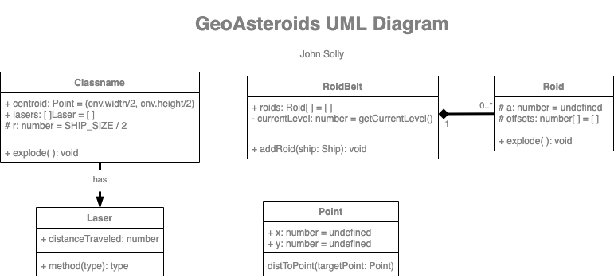

# GeoAsteroids

[](https://github.com/jsolly/GeoAsteroids/actions/workflows/GeoAsteroidsTest.yml)
[](https://coveralls.io/github/jsolly/GeoAsteroids?branch=main)
[](http://badges.mit-license.org)

A 2D spaceship game, <a href="https://geoasteroids.com" target="_blank" >Geoasteroids.com</a>


---

## Table of Contents

- [Installation](#installation)
- [Features](#features)
- [Contributing](#contributing)
- [Support](#support)
- [License](#license)

## Installation

1 - (Install <a href="https://nodejs.org/en/" rel="noopener noreferrer">Node.js</a>
2 - (Install <a href="https://www.mongodb.com/try/download/community" rel="noopener noreferrer">MongoDB</a>) (Or use a cloud service like <a href="https://www.mongodb.com/cloud/atlas" rel="noopener noreferrer">MongoDB Atlas</a>)

```shell
    $ git clone git@github.com:jsolly/GeoAsteroids.git
    $ cd GeoAsteroids
    $ npm install
```

## Setup

```shell
  $ cd <mongoDB_install_dir>/bin
  # Start MongoDB Server Locally (Or use a cloud service like MongoDB Atlas)
  $ ./mongod --dbpath <path to data directory>
  $ mongo # Or use a GUI like MongoDB Compass
  $ use geoasteroids
  $ db.createCollection("highscores")
  # Check src/database.ts for connection string
  $ vercel dev # Allows us to mock serverless functions locally
```

## Development

### Multiplayer Development Setup

For local multiplayer development, use the following commands:

```shell
# Run all development servers (Vite + WebSocket)
npm run dev:full

# Run individual servers
npm run dev              # Vite dev server (port 5173)
npm run dev:multiplayer  # WebSocket server (port 3001)
```


## Coverage, Tests, Linting

### Coverage

```shell
npm run coverage
```

### Test

```shell
npm run test
```

### Linting (with Biome)

```shell
npm run lint
```

- Biome is now configured using `biome.jsonc` for fast, reliable linting and formatting.
- The old ESLint configuration has been removed in favor of Biome's unified approach.
- To update rules or configuration, edit `biome.jsonc`.

---

## Contributing

Want to work on this with me? DM me on Twiiter <a href="https://twitter.com/_jsolly" target="_blank">`@_jsolly`</a>

### Step 1

- **Option 1**
  - 🍴 Fork this repo!

- **Option 2**
  - 👯 Clone to your local machine using `git@github.com:jsolly/GeoAsteroids.git`

### Step 2

- **HACK AWAY!** 🔨🔨🔨

### Step 3

- 🔃 Create a new pull request using <a href="https://github.com/jsolly/GeoAsteroids/compare" target="_blank">`https://github.com/jsolly/GeoAsteroids/compare`</a>.

---

## UML Diagram

</img>

---

## License

[](http://badges.mit-license.org)

- **[MIT license](http://opensource.org/licenses/mit-license.php)**
