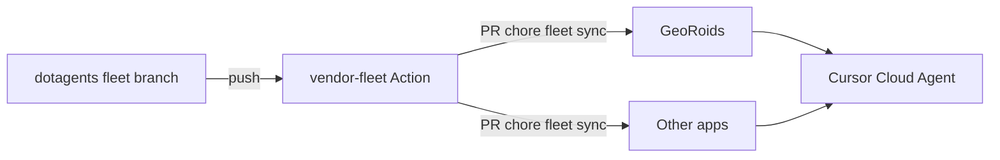

# Fleet & Cursor Cloud Setup Audit

**Date:** 2026-05-29  
**Repo audited:** [jsolly/GeoRoids](https://github.com/jsolly/GeoRoids) (primary; canonical template for fleet wiring)  
**Related:** [jsolly/dotagents](https://github.com/jsolly/dotagents) (private; not readable from this audit environment)  
**Audience:** You — planning a long-term fleet + Cursor Cloud model across personal repos  

---

## Executive summary

GeoRoids is **well along** the right path for Cursor Cloud: committed `.agents/` subtree, layered `AGENTS.md`, fleet rules symlinked into `.cursor/rules/`, project-only rules as real files, and a working `.cursor/environment.json`. Cloud agents can run product work **without** live access to dotagents as long as the vendored fleet in git is current.

The main gaps are **operational**, not architectural:

1. **No mechanical sync** from dotagents → app repos (no `FLEET.lock`, no vendor GitHub Action, no `repos.yaml` registry).
2. **dotagents is unreachable** from Cursor Cloud VMs with the current GitHub token (private repo not in app scope).
3. **Documentation contradicts itself** about cloud agents and `~/.agents` vs committed `.agents/`.
4. **Fleet conventions assume `docs/superpowers/`** but GeoRoids has not created that tree yet — `/review-fix-push` plan lookup will usually fall back to conversation intent.
5. **This audit covers one app repo**; fleet-wide consistency across “all my repos” is not yet enforceable from dotagents.

**Recommended long-term approach:** dotagents as canonical source → git subtree vendored into each app → **CI-driven vendor PRs** (not cloud `git fetch` at runtime) → Cursor GitHub app covers all app repos + dotagents for maintainers only → per-repo `environment.json` + optional team baseline environment.

---

## Scope and limitations

| In scope | Out of scope |
|----------|----------------|
| GeoRoids file layout, git history, scripts, docs | Contents of private `dotagents` repo (no clone/read access here) |
| Cursor Cloud config in-repo | Cursor dashboard team environments (not visible in git) |
| Symlink / rules / skills discovery | Other `jsolly/*` repos unless they mirror GeoRoids |
| Runtime checks (Node, tests, dev servers) | GitHub App installation UI state |

Evidence from this audit was collected on a Cursor Cloud VM (2026-05-29): Node v22.22.3, unit tests 205/205 pass, `check:ts` pass, dev servers start successfully after `npm run dev`.

---

## Current architecture (GeoRoids)

```text
GeoRoids/
├── AGENTS.md                    @.agents/AGENTS.md + ## Project + ## Cursor Cloud
├── .agents/                     git subtree (squash from dotagents @ 5c47d3e, 2026-05-29)
│   ├── AGENTS.md                fleet persona, collaboration, review workflow
│   ├── agents/                  16 review subagent prompts
│   ├── skills/                  review-fix, review-fix-push (+ references)
│   ├── rules/*.md               canonical guideline text
│   └── .cursor/rules/*.mdc      symlinks → ../rules/*.md
├── .cursor/
│   ├── environment.json         install + dev terminal
│   └── rules/
│       ├── *.mdc (symlinks)     fleet rules → .agents/.cursor/rules/
│       ├── browser-integration-testing.mdc   (project, 20KB)
│       └── log-files.mdc                     (project)
├── docs/
│   ├── cloud-agents.md          cloud + subtree how-to
│   └── superpowers/specs/       (this audit; convention newly started here)
└── scripts/
    ├── update-agents-subtree.sh
    └── link-fleet-rules.sh
```

### Git / subtree state

| Item | Value |
|------|--------|
| Subtree merge commit | `110f265` — chore(agents): vendor dotagents fleet via git subtree |
| Squash content commit | `7af0c09` — from dotagents `5c47d3e` |
| Cloud wiring commit | `1de0520` — link-fleet-rules, docs, environment.json, .gitignore |
| `dotagents` remote | Added on demand by script; **not** part of default clone until first `update-agents-subtree.sh` |
| `.agents/FLEET.lock` | **Missing** — no pinned upstream SHA in repo |
| Live fetch to dotagents | **Fails** from cloud (`Repository not found` — token lacks private repo access) |

### Rule symlink chain (verified working)

```text
.cursor/rules/code-style.mdc
  → .agents/.cursor/rules/code-style.mdc
    → .agents/rules/code-style.md
```

Git tracks fleet rule symlinks as mode `120000` under `.cursor/rules/` (good for cloud clones). Project rules are regular files (`100644`).

### `.gitignore` for Cursor

```gitignore
.cursor/*
!.cursor/environment.json
!.cursor/rules/
!.cursor/rules/**
```

This correctly keeps cloud config and rules in git while ignoring other local Cursor state.

---

## What is working well

### 1. Cloud-self-contained runtime model

Cloud agents discover:

- **Skills:** `.agents/skills/` (`review-fix`, `review-fix-push`)
- **Fleet rules:** `.cursor/rules/` (symlinked fleet + project `.mdc`)
- **Instructions:** root `AGENTS.md` including `@.agents/AGENTS.md`

No dependency on `~/.agents/` or machine-local Cursor paths — aligned with [Cursor Cloud setup](https://cursor.com/docs/cloud-agent/setup).

### 2. Clear split: fleet vs project

| Asset | Location | In git |
|-------|----------|--------|
| Persona, review fleet, code-style | `.agents/` | Yes (subtree) |
| Browser integration playbook | `.cursor/rules/browser-integration-testing.mdc` | Yes (project) |
| Log paths | `.cursor/rules/log-files.mdc` | Yes (project) |
| Dev boot | `.cursor/environment.json` | Yes |
| Game architecture, commands | `AGENTS.md` ## Project | Yes |

### 3. Operational scripts exist

- `scripts/link-fleet-rules.sh` — idempotent; preserves project real files
- `scripts/update-agents-subtree.sh` — fetch + squash pull + relink

### 4. Cloud environment is appropriate for this stack

```json
{
  "install": "npm ci || npm install && (test -f .env || cp .env.example .env)",
  "terminals": [{ "name": "dev", "command": "npm run dev" }]
}
```

Matches Node ≥22, copies `.env` on fresh clones (recent `fix(dev)` commit), starts Vite + WS server for integration tests.

### 5. Review toolchain is substantial

- 16 specialized review agents under `.agents/agents/`
- Documented orchestration, output contract, extension gating in skill references
- `/review-fix-push` as sole merge gate (no PRs) — consistent with personal-project workflow in fleet `AGENTS.md`

---

## Findings (gaps and risks)

Severity: **Critical** · **High** · **Medium** · **Low**

| ID | Sev | Finding |
|----|-----|---------|
| F1 | **Critical** | **No fleet vendor automation.** Updates depend on manually running `update-agents-subtree.sh` per repo. As repo count grows, fleet drift is guaranteed. |
| F2 | **High** | **dotagents not accessible from Cursor Cloud** with current credentials. Cloud agents cannot pull or push fleet at runtime; docs still imply they might (`AGENTS.md` fleet updates via subtree script). |
| F3 | **High** | **`.agents/AGENTS.md` contradicts cloud model.** Line 26: “Cloud agents: no `.agents/`” — incorrect. Cloud agents **must** use committed `.agents/`; they must **not** use `~/.agents/`. |
| F4 | **High** | **`docs/superpowers/{specs,plans}/` missing** in GeoRoids while fleet rules and `/review-fix-push` orchestration require them for plan/spec discovery (D.1). Plans will usually degrade to “review against diff only.” |
| F5 | **Medium** | **No `FLEET.lock`.** Cannot tell from git whether vendored fleet matches dotagents `fleet` HEAD or how stale the copy is. |
| F6 | **Medium** | **`refresh-fleet.sh` documented but not in GeoRoids.** Lives in `~/.agents` / dotagents per docs; easy to follow wrong path when editing fleet from an app repo. |
| F7 | **Medium** | **`update-agents-subtree.sh` defaults to SSH** (`git@github.com:...`). Cloud VMs use HTTPS + installation token; script should support `FLEET_SYNC_TOKEN` or rely on vendor CI instead. |
| F8 | **Medium** | **No GitHub Actions for fleet sync** in GeoRoids (or visible in `.github/workflows/`). CI only runs tests/lint/CodeQL — no `chore(fleet): sync` PRs. |
| F9 | **Low** | **`check:lint` has pre-existing Biome issues** (e.g. optional chain in `playerNetwork.ts`, import order in `Roid.ts`). Unrelated to fleet but affects “green repo” signal for agents. |
| F10 | **Low** | **Double symlink indirection** (`.cursor` → `.agents/.cursor` → `.agents/rules`). Works on Linux/cloud; fragile on Windows without Developer Mode — acceptable if fleet stays Linux/cloud-first. |
| F11 | **Low** | **Repo name mismatch in docs** (`GeoAsteroids` vs `GeoRoids`). Cosmetic but confusing in links and dashboards. |

---

## Documentation audit

| Document | Accurate? | Notes |
|----------|-----------|-------|
| `docs/cloud-agents.md` | Mostly | Good layout diagram; `~/.agents` workflow is local-only; should state cloud **cannot** fetch dotagents without app access |
| `AGENTS.md` ## Cursor Cloud | Mostly | Points to subtree update script — should prefer “merge fleet PR” once CI exists |
| `.agents/AGENTS.md` | **No** | Fix cloud bullet (F3); clarify canonical edit path is **dotagents**, not app `.agents/` |
| `CLAUDE.md` | Yes | `@AGENTS.md` only |
| Fleet `specs-and-plans` rule | N/A in repo | Convention not yet adopted in GeoRoids tree (F4) |

Recent commit `8b91b1a` correctly updated `refresh-fleet.sh --push` naming in `docs/cloud-agents.md` — small sign docs are actively maintained.

---

## dotagents & multi-repo (inferred)

Because `dotagents` is private, this audit could not verify:

- Whether `fleet` branch matches squash commit `5c47d3e` today
- Presence of `refresh-fleet.sh`, `fleet/repos.yaml`, vendor Action, or scaffold scripts
- Whether other app repos already have `.agents/` subtree

**Inferred intent from GeoRoids + fleet docs:**

- **Canonical:** dotagents (`fleet` branch for subtree export; `main` with `fleet/` mirror per comments)
- **Distribution:** git subtree into `.agents/` per app
- **Optional local:** `~/.agents` with refresh scripts (legacy ergonomics)

**Gap:** The “control plane” (dotagents automation + registry) is not yet visible from GeoRoids — only the “data plane” (vendored copy) is.

---

## Cursor Cloud platform fit

| Concern | GeoRoids status | Recommendation |
|---------|-----------------|----------------|
| Repo-scoped clone | Yes | Keep — primary unit of work |
| `environment.json` in repo | Yes | Keep; add `## Cursor Cloud` task hints if install grows |
| Multi-repo environment | Not configured | Optional **Fleet Maintainer** env (dotagents + one app) — not for every task |
| GitHub App repo list | GeoRoids only (in cloud VM) | Add **all app repos + dotagents** for maintainers |
| Secrets | `.env` from example | Keep app secrets in dashboard; fleet has no secrets |
| Runtime fleet fetch | Documented | **Remove from cloud path** — use vendored + CI |

Verified cloud capabilities on this VM:

- `npm ci`, `check:ts`, `npm test` — pass
- `npm run dev` — health OK (`:3001/health`, `:5173`)
- `git ls-remote dotagents` — **fail** (access)

---

## Recommended approach (long-term)

### Design principles

1. **Runtime inheritance = committed `.agents/` in each app repo.**
2. **Authority = dotagents `fleet` branch.**
3. **Propagation = mechanical (GitHub Actions), not agent memory or cloud `install`.**
4. **Cloud agents on apps do not need dotagents in the clone** for normal work.
5. **One registry** (`fleet/repos.yaml` in dotagents) drives who gets vendor PRs.

### Target flow



### Phase 0 — Platform (you, outside git)

- [ ] Cursor → [GitHub Integrations](https://cursor.com/dashboard?tab=integrations): grant app access to **all repos you want cloud agents on**, including **`jsolly/dotagents`**.
- [ ] Optional: team **saved environment** (Node 22 baseline); per-repo `environment.json` overrides (GeoRoids pattern).
- [ ] Optional: **Fleet Maintainer** multi-repo cloud environment (dotagents + GeoRoids) for rare fleet edits only.

### Phase 1 — dotagents control plane (highest ROI)

In **dotagents** (not GeoRoids):

- [ ] Add `fleet/repos.yaml` listing every app repo and subtree prefix.
- [ ] Add `.github/workflows/vendor-fleet.yml` — on push to `fleet`, open sync PRs to registered repos.
- [ ] Add `fleet/scaffold/` or `scripts/init-app-repo.sh` for new repos.
- [ ] Fix `.agents/AGENTS.md` cloud bullet; document CI-first sync.
- [ ] Re-export / push `fleet` branch; let vendor Action update GeoRoids.

### Phase 2 — Harden GeoRoids (template repo)

- [ ] Add `.agents/FLEET.lock` (commit SHA from dotagents `fleet`).
- [ ] Create `docs/superpowers/specs/` and `docs/superpowers/plans/` (empty `.gitkeep` or first real spec).
- [ ] Update `docs/cloud-agents.md` and `AGENTS.md` ## Cursor Cloud:
  - Normal work: use committed fleet.
  - Fleet updates: merge `chore(fleet): sync` PRs, or run `update-agents-subtree.sh` locally.
  - Do not expect `git fetch dotagents` in cloud unless app has repo access.
- [ ] Extend `update-agents-subtree.sh` to honor `FLEET_SYNC_TOKEN` for HTTPS when set.
- [ ] Move this audit’s recommendations into a short `docs/cloud-agents.md` “Fleet sync” section after Phase 1 ships.

### Phase 3 — Roll out to other repos

For each additional `jsolly/*` repo:

- [ ] Run scaffold from dotagents (subtree add, `AGENTS.md` stub, scripts, `environment.json` template).
- [ ] Register in `fleet/repos.yaml`.
- [ ] Merge initial vendor PR.
- [ ] Add project-only `.cursor/rules/*.mdc` as needed.

### Phase 4 — Governance (when fleet is multi-repo)

- [ ] CI check: if `.agents/` changes, `FLEET.lock` must match dotagents `fleet` HEAD (or be updated in same PR).
- [ ] `fleet/CHANGELOG.md` in dotagents for breaking skill/agent changes.
- [ ] Optional: tag dotagents `fleet` (e.g. `fleet-2026.05.29`) referenced in lock files.

---

## What not to do

| Anti-pattern | Why |
|--------------|-----|
| `git subtree pull` in `environment.json` `install` | Slow, needs extra creds, fights Cursor caching |
| Multi-repo cloud env for every app | Operational overhead |
| Treat `~/.agents` as source of truth | Invisible to cloud and GitHub |
| Edit fleet only in GeoRoids without pushing to dotagents | Drift across repos |
| Rely on cloud agents to “pull latest fleet” before each task | Unreliable; wrong layer |

---

## Checklist: is a repo “fleet-ready”?

Use GeoRoids as the reference implementation.

| Requirement | GeoRoids |
|-------------|----------|
| `.agents/` git subtree from dotagents `fleet` | Yes |
| Root `AGENTS.md` includes `@.agents/AGENTS.md` + ## Project | Yes |
| `scripts/link-fleet-rules.sh` | Yes |
| `.cursor/rules/` fleet symlinks + project rules | Yes |
| `.cursor/environment.json` committed | Yes |
| `.gitignore` allows `.cursor/environment.json` + rules | Yes |
| `docs/cloud-agents.md` (or equivalent) | Yes |
| `.agents/FLEET.lock` | **No** |
| `docs/superpowers/{specs,plans}/` | **No** (started with this audit only) |
| Listed in dotagents `fleet/repos.yaml` | Unknown |
| Vendor Action opens sync PRs | Unknown |

---

## Appendix A — File inventory (GeoRoids `.agents/`)

| Path | Count / notes |
|------|----------------|
| `.agents/agents/*.md` | 16 review agents |
| `.agents/skills/` | 2 skills, 10 reference files |
| `.agents/rules/*.md` | 4 guideline files |
| `.agents/.cursor/rules/*.mdc` | 4 symlinks to `rules/` |

---

## Appendix B — Commands used in this audit

```bash
# Subtree / remotes
git log --oneline -- .agents/
git remote -v
git ls-files .cursor .agents

# Symlinks
ls -la .cursor/rules/
readlink -f .cursor/rules/code-style.mdc

# dotagents reachability (failed in cloud)
git ls-remote https://github.com/jsolly/dotagents.git refs/heads/fleet

# Cloud runtime
node -v && npm run check:ts && npm run test
npm run dev  # then curl :3001/health and :5173
```

---

## Decision record (recommended defaults)

| Question | Decision |
|----------|----------|
| Where do cloud agents get fleet config? | Committed `.agents/` in each app repo |
| Where is fleet edited? | dotagents `fleet` branch (canonical) |
| How do repos stay in sync? | GitHub Action vendor bot + `repos.yaml` |
| Do cloud agents need dotagents access? | **No** for product work; **yes** for fleet maintainers / CI |
| Keep git subtree? | **Yes** — automate pulls via PRs |
| Keep `~/.agents` workflow? | Optional local convenience only; document as non-canonical for cloud |

---

## Next steps (suggested order)

1. Fix fleet `AGENTS.md` cloud wording in **dotagents**; vendor to GeoRoids.
2. Implement **vendor Action + `repos.yaml`** in dotagents.
3. Add **`FLEET.lock`** and **`docs/superpowers/`** skeleton to GeoRoids.
4. Add **dotagents** to Cursor GitHub app repository access.
5. Register remaining personal repos in `repos.yaml` and merge initial sync PRs.

---

*This document is a design/spec artifact per fleet `specs-and-plans` convention. Implementation plans can reference it as:*

`**Spec:** docs/superpowers/specs/2026-05-29-fleet-cloud-setup-audit-design.md`
